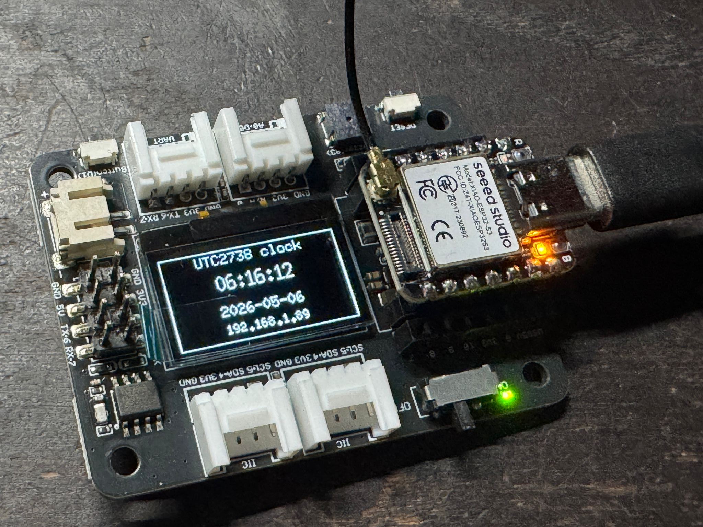

# UTC_2738_STEER

A PlatformIO firmware for the Seeed Studio XIAO ESP32-S3 Plus, part of the Maker Starter Kit.

## Hardware

- **Main Board:** [Seeed Studio XIAO ESP32-S3 Plus](https://www.seeedstudio.com/XIAO-ESP32S3-p-5627.html)
- **Expansion Base:** [Seeed Studio XIAO Expansion Board Wiki](https://wiki.seeedstudio.com/Seeeduino-XIAO-Expansion-Board/)

## Features

- **Board Bring-up:** Automated diagnostic tests for OLED, RTC, and WiFi.
- **Clock:** Live NTP clock updates.
- **Configurable:** Feature blocks can be toggled via compile-time switches.

## Development Setup

Students should first follow the official Seeed Studio XIAO ESP32S3 getting started guide to set up the board, USB connection, and drivers: [Seeed Studio XIAO ESP32S3 Getting Started](https://wiki.seeedstudio.com/xiao_esp32s3_getting_started/).

After the board is recognized by your computer, follow the project-specific instructions in [SETUP.md](SETUP.md) to configure PlatformIO, build the firmware, and upload it.

## License

This project is licensed under the MIT License - see the [LICENSE](LICENSE) file for details.

## Copyright

© 2026 SL2 - Sustainable Living Lab
[Sustainable Living Lab (SL2)](https://www.sl2square.org)

**Version:** 0.1.2
